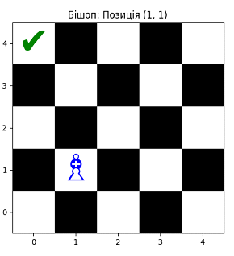
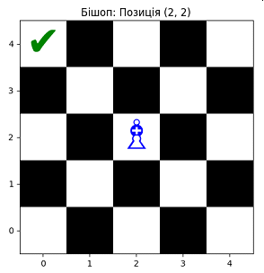
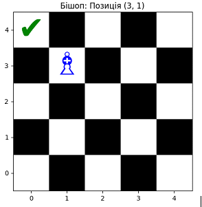
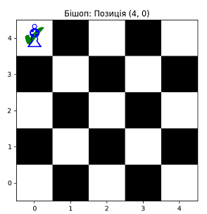
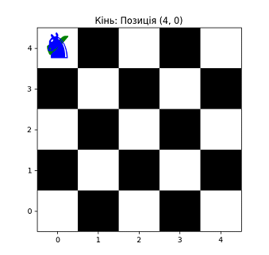
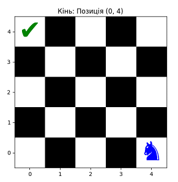
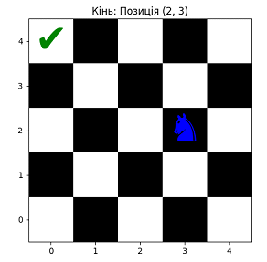
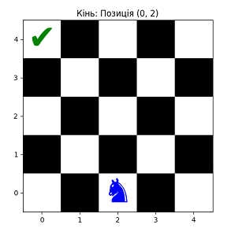
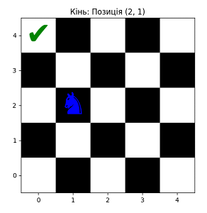

# ♗♞ Chess-Inspired Agent Performance Analytics

## 📌 Project Overview
This project applies **Reinforcement Learning (Q-Learning)** combined with **Data Analytics** techniques to compare the learning efficiency of two chess-inspired agents — **Bishop** and **Knight** — navigating a 5×5 grid toward a goal state.

The primary focus is not just on algorithm implementation, but on **collecting, analyzing, and visualizing** agent performance data to extract actionable insights.

---

## 🎯 Objectives
- Simulate two agents with different movement constraints.
- Track training metrics over 1,000 episodes.
- Perform comparative analysis of learning performance.
- Visualize both the learning process and the optimal paths found.

---

## 🛠 Tech Stack
- **Python** — core implementation & data processing
- **NumPy** — Q-table operations & metric calculations
- **Matplotlib** — performance visualization & path plotting
- **Jupyter Notebook** — experimentation & reporting

---

## 📊 Analytical Approach

### 1. **Data Collection**
- Recorded per-episode **total rewards**.
- Logged agent positions and decision paths.
- Captured **learning convergence patterns**.

### 2. **Metrics Analyzed**
- **Cumulative Rewards** — total reward progression over episodes.
- **Convergence Speed** — how quickly each agent optimized its policy.
- **Path Efficiency** — number of steps to goal after convergence.
- **Exploration Diversity** — variance in visited states.

### 3. **Experiment Setup**
| Parameter        | Value        |
|------------------|-------------|
| Board Size       | 5×5         |
| Episodes         | 1,000       |
| Learning Rate α  | 0.1         |
| Discount γ       | 0.9         |
| Epsilon (ε)      | 0.1         |
| Goal Position    | (4, 0)      |
| Bishop Moves     | Diagonals   |
| Knight Moves     | L-shaped    |

---

## 📈 Results

### **Reward Progression**
Bishop demonstrated **faster convergence** due to direct diagonal mobility, while Knight showed **higher exploration** but slower optimization.

| Agent   | Avg. Reward After Convergence | Convergence Episodes |
|---------|-------------------------------|----------------------|
| Bishop  | ~95                           | ~150                 |
| Knight  | ~88                           | ~250                 |


---

## Path Visualization
**Bishop — Optimal Path:**  
[](doc/bishop/1.png) [](doc/bishop/2.png) [](doc/bishop/3.png) [](doc/bishop/4.png) [](doc/knight/5.png)

**Knight — Optimal Path:**  
[](doc/knight/1.png) [](doc/knight/2.png) [](doc/knight/3.png) [](doc/knight/4.png)


---

## 🔍 Key Insights
1. **Movement Constraints Impact Learning** — direct movement patterns accelerate convergence.
2. **Exploration vs. Exploitation** — Knight explored more states but took longer to stabilize.
3. **Reward Structures Shape Policy** — small penalties per step encouraged shorter paths.

---

## 🚀 How to Run
```bash
git clone https://github.com/yourusername/chess-agents-analytics.git
cd chess-agents-analytics
pip install -r requirements.txt
python main.py
